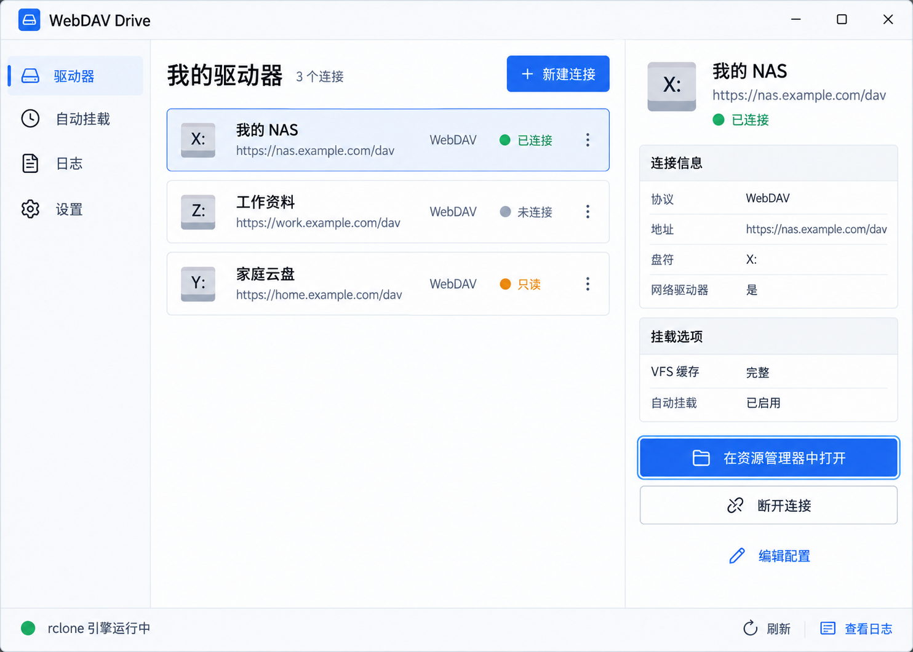

# WebDAV Drive

一个面向 Windows 的轻量 WebDAV 挂载工具：把 WebDAV 服务挂载为本机盘符或目录，并通过托盘统一管理连接。

[](LICENSE)
[](https://www.microsoft.com/windows)
[](https://www.rust-lang.org/)



## 功能

- 创建、编辑、测试和删除 WebDAV 连接；
- 挂载到 Windows 盘符或目录，并可直接在资源管理器中打开；
- 通过 rclone 驱动挂载，支持只读、缓存、额外参数等配置；
- 最小化到系统托盘，可注册开机自动挂载；
- 从托盘退出时先卸载全部驱动器，确认挂载消失后再结束程序；
- 配置原子保存并保留备份，密码使用 Windows DPAPI 保护；
- 内置运行状态、日志和错误提示。

> 当前发布包面向 Windows x64，尚未进行代码签名。Windows 首次运行时可能显示 SmartScreen 提示。

## 下载与使用

1. 安装 [WinFsp](https://winfsp.dev/rel/)；它是 rclone 在 Windows 上提供文件系统挂载所需的运行环境。
2. 从 [Releases](https://github.com/yashuamao/WebDavDrive/releases) 下载最新版 `WebDavDrive-<版本>.zip` 并解压。
3. 双击 `drive.exe`，新建连接并填写 WebDAV 地址、账号和密码。
4. 保存后先测试连接，再选择盘符或目录并挂载。

关闭主窗口只会隐藏到托盘。要彻底退出，请使用托盘菜单“退出并卸载所有驱动器”；若卸载失败，程序会保留运行状态并允许重试或强制退出。

## 数据与安全

运行数据默认保存在 `%PROGRAMDATA%\WebDavDrive`：

| 文件 | 用途 |
|---|---|
| `profiles.json` | 连接配置；密码经机器范围 DPAPI 保护 |
| `rclone.conf` | rclone 配置；使用静态加密 |
| `config_key.enc` | 经 DPAPI 保护的 rclone 配置密钥 |
| `agent.log` | 运行日志 |

程序启动时会收紧数据目录 ACL。机器范围 DPAPI 仍允许本机具备相应权限的用户解密，因此多用户或高安全环境应配合独立账户和外部密钥管理。

## 从源码构建

要求：Windows、Rust 1.82+、Node.js 20+、WebView2 Runtime，以及已安装的 WinFsp。离线命令要求依赖已经存在于本机 Cargo/npm 缓存。

```powershell
cd apps\drive\ui
npm ci
npm run build
cd ..\..\..
cargo check --offline --workspace
cargo test --offline --workspace -- --test-threads=1
cargo build --offline --release -p drive -p drive-core --features drive/custom-protocol
```

运行源码构建的 `drive.exe` 时，需把 `rclone.exe` 放在程序同目录或 `bin\`，也可以设置 `RCLONE_EXE`。

## 打包 Windows 免安装版

```powershell
.\scripts\package-windows.ps1 -RclonePath <rclone.exe路径> -Zip
```

省略 `-RclonePath` 时，脚本依次检查 `RCLONE_EXE` 和 `bin\rclone.exe`。找不到引擎会直接报错；仅在明确需要不含引擎的产物时使用 `-SkipRclone`。

产物位于 `dist\WebDavDrive-<版本>\`，包含主程序、口令辅助程序、rclone 引擎、使用说明和许可文件。WinFsp 不会打进发布包，需由用户单独安装。脚本不会注册计划任务或写入注册表。

## 项目结构

```text
crates/                      # 可复用底座，不依赖 WebDAV/rclone/Tauri 领域概念
  foundation-core/           # 错误、日志、基础 trait
  foundation-config/         # 版本化配置、原子写、备份与损坏隔离
  foundation-secrets/        # DPAPI/密钥抽象
  foundation-windows/        # Job Object、ACL、计划任务、单实例
  foundation-supervisor/     # 外部进程托管与就绪探测
apps/
  drive-core/                # WebDAV Drive 业务核心与 rclone provider
  drive/src-tauri/           # Tauri 2 桌面宿主
  drive/ui/                  # React + TypeScript + Vite 桌面界面
docs/                        # 需求、架构、ADR 与历史资料
```

## 开源项目致谢与参考

| 项目 | 许可 | 在 WebDAV Drive 中的作用 |
|---|---|---|
| [rclone](https://github.com/rclone/rclone) | MIT | 实际挂载引擎及 RC API；Windows 发布包包含 `rclone.exe` |
| [WinFsp](https://github.com/winfsp/winfsp) | GPLv3 + FLOSS 例外 / 商业授权 | rclone 在 Windows 上挂载所需的文件系统层；由用户另行安装，不随包分发 |
| [Tauri](https://github.com/tauri-apps/tauri) | MIT 或 Apache-2.0 | Windows 桌面宿主、WebView 窗口与系统托盘 |

界面布局和连接管理流程参考了 [RaiDrive](https://www.raidrive.com/) 的产品体验，但未使用其代码；RaiDrive 不属于上表中的开源依赖。其他 Rust 依赖及其锁定版本见 `Cargo.lock`，第三方声明见 [THIRD_PARTY_NOTICES.md](THIRD_PARTY_NOTICES.md)。

## 设计资料

- 行为规格与验收基线：[docs/requirements.md](docs/requirements.md)
- 目标架构与阶段计划：[docs/architecture.md](docs/architecture.md)
- 架构决策记录：[docs/adr/](docs/adr/)
- 旧 Python 版资料归档：[docs/legacy/](docs/legacy/)

## 许可

WebDAV Drive 以 [MIT License](LICENSE) 开源。第三方组件仍分别适用其自身许可，详见 [THIRD_PARTY_NOTICES.md](THIRD_PARTY_NOTICES.md)。
